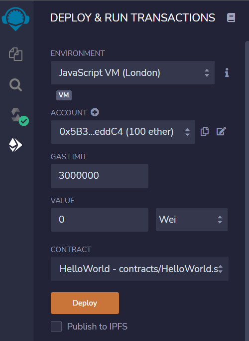
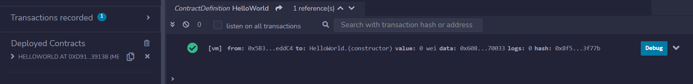

# Deploy

Após compilar o contrato, devemos enviá-lo para a rede onde queremos implementá-lo. Isso significa fazer o **deploy** do contrato. Fazer o deploy é enviar o bytecode para ser inserido na blockchain. Neste momento, uma nova conta de contrato é criada, e esta conta irá apontar para seu bytecode. Também é alocado um espaço privado para a conta, chamada de storage, onde ficarão armazenadas suas variáveis de estado. 

A implantação na rede principal da Ethereum ou em outra blockchain custa tokens. No caso do Ethereum, você deve pagar com ether. Para resolver esse problema (não queremos aprender a escrever contratos gastando dinheiro), existem redes de teste onde os tokens podem ser obtidos gratuitamente. No entanto, começaremos fazendo o deploy dos contratos em um blockchain virtual mantido pelo próprio Remix.

Para implantar usando o Remix, clique no quarto item do menu à esquerda para abrir a tela de implantação, conforme a figura abaixo.

Por enquanto, não preste muita atenção nas opções da tela. Certifique-se de que o **environment** (ambiente) esteja definido como VM JavaScript (Merge, Londres ou Berlim). Merge, London e Berlin são versões diferentes do EVM, mas não há muita diferença entre elas quando estamos apenas testando os contratos.

Clique em *Deploy* e observe que algumas novas informações aparecerão na parte inferior do Remix. Veja a figura abaixo.

Na parte inferior esquerda da tela, o Remix lista os contratos publicados. Note que agora ele passará a indicar que existe um contrato publicado, bem como seu respectivo endereço (da sua conta de contrato).

No canto inferior direito, o Remix lista o resultado das últimas transações. Nesse caso, há apenas uma transação, a implantação do contrato. A marca verde indica que a transação foi bem-sucedida.

Parabéns! Você não apenas escreveu seu primeiro contrato, mas também fez o deploy em uma blockchain (embora seja uma blockchain de teste local).