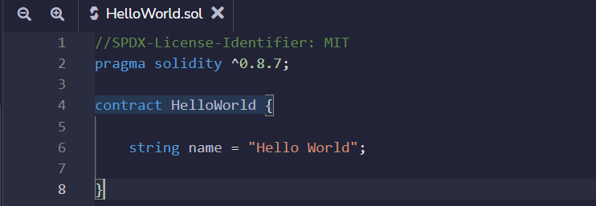

# O Estado Global (World State)

O conjunto de todos os estados da blockchain é seu estado global, chamado de **world state**. Quando fazemos uma transação, mudamos seu estado global. A implantação de um contrato, por exemplo, altera o estado global de várias maneiras. O mais óbvio é que um novo contrato é criado na blockchain, mas essa não é a única alteração.

Contratos têm um endereço, que designa uma conta na Ethereum. Existem dois tipos de contas no Ethereum, contas de contrato e contas de propriedade externa, **EOA** (**E**xternally **O**wned **A**ccounts) para abreviar. Quando implantamos um contrato, uma nova conta de contrato é criada.

Associados a cada conta de contrato, há quatro valores. Um é o código binário do contrato que implantamos, o bytecode. Outro é um mapa para a *storage*, onde são armazenadas todas as variáveis de estado criadas no contrato. Somente o contrato pode acessar e alterar suas variáveis de estado, embora seja possível ler a *storage* diretamente do banco de dados.

Lembre-se que as variáveis são inicializadas no momento de sua declaração (se não explicitamente, elas assumem seu valor padrão). Portanto, as variáveis são inicializadas no momento do deploy, o que faz com que novos estados sejam definidos e criados neste momento.

Outras modificações no estado global são menos perceptíveis no momento do deploy. Uma delas é a alteração no saldo da conta que implantou o contrato. Toda transação no Ethereum custa ether, então a conta que implanta o contrato deve pagar essa taxa em ether. Quero salientar que o saldo de uma conta faz parte do estado blocal, portanto qualquer transação altera o saldo de uma conta, alterando assim o estado global.

O código do nosso contrato escrito até agora pode ser visto na imagem abaixo. Ele define uma variável de estado, `nome`, do tipo `string`, que fará parte do estado global da Ethereum.

Se quisermos poder alterar essa variável de estado, devemos escrever uma função que faça isso. Veremos isso em breve. Antes, veremos como podemos simplesmente ler esta variável de estado.