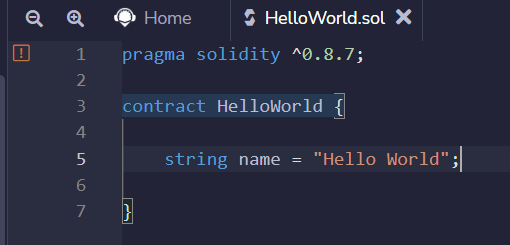

# Hello World

Para indicar que começamos um novo contrato, utilizamos a sentença `contract`, da forma

```
    contract HelloWorld {...}
```

Solidity utiliza uma sintaxe baseada em chaves (*curly braces*), de forma parecida com C, Java, JavaScript etc. Tudo o que estiver dentro de `contract` fará parte de nosso contrato, porém o compilador irá utilizar também declarações fora deste escopo. 

Para quem já é programador, pode pensar que a declaração `contract` é similar à declaração de uma nova classe. De fato, contratos podem ser instanciados por outros contratos, de forma similar a que fazemos com objetos. Isto será visto mais adiante.

A estrutura de um contrato é composta por vários ingredientes. O primeiro que vamos ver é a declaração de **variáveis de estado**, que farão parte do estado global da rede. Neste contrato, vamos começar declarando uma variável de estado do tipo `string`.

```
    string name = "Hello World";
```

Solidity é uma linguagem estaticamente tipada, de forma que precisamos explicitamente indicar qual o tipo da variável que estamos definindo. `String` é um tipo primitivo de Solidity. O nome da variável é `name` e ela é inicializada com o valor `Hello World`.

Variáveis não precisam ser explicitamente inicializadas em Solidity, porém caso não sejam inicializadas no momento de sua definição, assumirão seu valor padrão. No caso de uma string, o valor padrão é vazio, ou "". 

Todas as variáveis que definimos fora de funções são chamadas variáveis de estado e são permanentes na blockchain. No momento do deploy do contrato, um espaço dedicado é alocado para o armazenamento das variáveis de estado. Ou seja, todas as variáveis que queremos que sejam permanentes devem ser declaradas fora de funções.

Para salvar o contrato, basta utilizar as teclas ***Ctrl+S*** (ou equivalente no seu sistema operacional) e ele será compilado automaticamente após salvo. Ao fazer isso, note que o compilador apresenta um aviso, indicado por uma exclamação em laranja. Veja na figura abaixo:



Ao passar o mouse pela exclamação, o motivo do aviso é indicado. No nosso caso, o motivo do aviso é o seguinte:
*Warning: SPDX license identifier not provided in source file. Before publishing, consider adding a comment containing "SPDX-License-Identifier: " to each source file.*

Deixe-me explicar o motivo. É recomendável incluir uma indicação de licença de uso no contrato, em vista que seu código será publico. Ainda que não seja obrigatório, vamos fazer isso, incluindo a seguinte linha antes da definição do compilador.

```
//SPDX-License-Identifier: MIT
```

Devemos ficar atentos aos avisos do compilador. Ainda que os avisos não impeçam a compilação do contrato, eles devem ser corrigidos antes de realizar o deploy na blockchain.

Após incluir a linha acima como primeira linha de código, salve novamente o arquivo e note que o aviso irá desaparecer. Parabéns, você escreveu seu primeiro contrato inteligente em Solidity, ainda que ele não faça nada além de guardar o valor `Hello World` como uma variável de estado na blockchain.