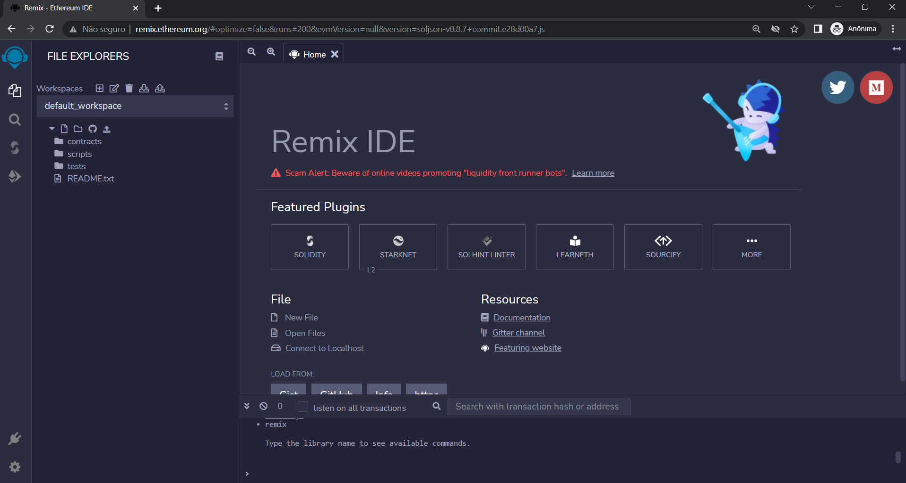
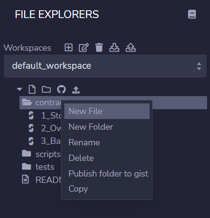

# Introdução ao Remix

Como vimos, a maquina virtual da Ethereum, EVM, tem uma linguagem de máquina (virtual) própria, e seja qual linguagem de alto nível que utilizemos, ela precisa ser compilada para a EVM. O compilador que faz a compilação de Solidity para a EVM chama-se **solc**, e pode ser instalado de diversas formas. O *solc* também faz a compilação da Yul, porém Vyper tem seu próprio compilador.  

A forma mais fácil de escrever, compilar e fazer o deploy de um contrato inteligente é utilizando uma plataforma integrada da desenvolvimento, uma **IDE** (**I**ntegrated **D**evelopment **E**nvironment). Neste livro, iremos utilizar uma IDE on-line chamada **Remix**.

É também possível fazer o download e instalar o Remix em desktop, porém o Remix não costuma ser utilizada para produção. Atualmente, as IDEs de produção mais utilizadas são Truffle e Hardhat. Para aprendizado, no entanto, Remix é certamente uma das melhores plataforma.

O Remix pode ser acessada no endereço [remix.ethereum.org](http://remix.ethereum.org).



O Remix possui 4 painéis: ícones, sidebar, painel principal e terminal. O painel de ícones altera o que está exibido na sidebar. Por padrão, o Remix começa com 4 ícones: Explorador de arquivos, busca, compilador e deploy & run transactions. O painel principal é onde editamos o arquivos, e o terminal é onde são exibidas informações sobre as transações executadas.

Vamos começar com o explorador de arquivos. Nele, podemos criar novas áreas de trabalho (workspaces) ou trabalhar com apenas uma workspace. O Remix começa apenas com uma zona de trabalho, chamada de *default workspace*. Não iremos nos preocupar muito com a organização dos arquivos, já que usaremos o Remix apenas para aprendizado. Assim, nos limitaremos a utilizar a workspace padrão.

Para começar um novo contrato, começamos criando um novo arquivo na pasta *contracts*, localizada no lado esquerdo. Podemos ver isso na imagem abaixo:




As pastas *scripts* e *tests* não serão utilizadas por nós. Ao compilar seu primeiro contrato, você irá notar que o Remix cria uma nova pasta chamada *artifacts*. Explicaremos melhor sobre esta nova pasta em breve.

Vamos chamar o novo arquivo a ser criado de `HelloWorld.sol` (para a surpresa de ninguém). Não há um padrão para o nome de contratos, porém a extensão de Solidity é `.sol`. Caso você não inclua uma extensão, o Remix irá incluí-la por você. Ele então irá abrir este novo arquivo no painel principal, onde poderemos começar a escrever o contrato inteligente.

Vamos escrever nosso primeiro contrato explicando passo-a-passo.

Iniciamos informando a versão do compilador que queremos executar, com a diretriz `pragma`, da forma

```
    pragma solidity ^0.8.7;
```

Com isso queremos dizer que o compilador a ser utilizado deve ser a versão 0.8.7 ou maior, porém desde que o número 8 não mude. Ou seja, qualquer versão 0.8.**X** onde X seja maior ou igual a 7 será aceita. Qualquer versão 0.9.X não será aceita.

Há várias formas de definir a versão do compilador a ser utilizada. A mais simples é indicar a versão completa, por exemplo, 0.8.7. Em geral, no entanto, queremos utilizar qualquer versão maior do que a indicada, desde que não tenha sofrido qualquer mudança que possa quebrar a compatibilidade com versões anteriores. Para isso utilizamos o chapéu "`^`". 

No momento em que escrevo esse texto, a última versão do compilador é a 0.8.18, e o Remix usa, por padrão, a versão 0.8.7. Isso pode ser alterado no próprio Remix, ao clicar o ícone de compilação, fazendo com que a sidebar mostre o painel de compilação.