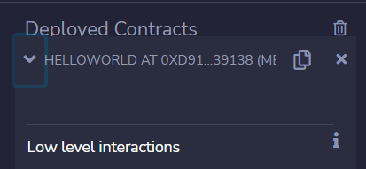
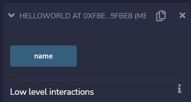

# Public variables

Variáveis de estado, em Solidity, possuem visibilidade. Existem três possibilidades de visibilidade: **pública** (public), **privada** (private) ou **interna** (internal). Quando não declaramos explicitamente a visibilidade da variável de estado, ela é considerada interna. Este é o caso da variável `name` em nosso exemplo. Variáveis locais, que ainda não vimos, não têm visibilidade; ou melhor, eles são visíveis apenas dentro da função onde são declaradas.

Variáveis internas podem ser acessadas pelo próprio contrato e por contratos filhos (herdados). Veremos a questão da herança mais adiante. Variáveis privadas só podem ser acessadas pelo contrato, o que as torna um tipo mais restrito do que variáveis internas.

A outra opção, variáveis públicas, faz com que o compilador crie uma função getter para ela. Isso ficará mais claro ao longo do curso. Por enquanto, apenas entenda que variáveis públicas podem ser acessadas fora do contrato. Vamos ver como fazer isso nesta lição.

No Remix, clique no contrato que você acabou de implantar na guia de contratos implantados (*deployed contracts*). Observe que não há nenhum método a ser executado por ele, conforme a figura abaixo.



Agora vamos modificar o contrato, alterando a visibilidade da variável `nome` para public. Altere esta linha de código para:

```
string public name = "Hello World";
```

O que fizemos foi adicionar a visibilidade `public` para esta variável de estado.

Precisamos fazer novamente o deploy do contrato porque o alteramos. Depois de feito o deploy, um novo contrato (que terá uma nova conta de contrato) será listado na guia de contratos implantados. Ao clicar nele, você verá que agora existe um método a ser executado, chamado `name`, conforme a imagem abaixo.



Este método é usado para buscar o valor da variável no blockchain. Para cada variável pública, o compilador gera um getter equivalente para que elas possam ser facilmente lidas por outros contratos ou por qualquer cliente externo.

Uma questão que devemos esclarecer é que qualquer estado no blockchain é, de alguma forma, público. Mesmo que a variável seja declarada como interna ou privada, ela ainda pode ser recuperada indiretamente por um cliente. A declaração de uma variável pública apenas cria um método getter para a variável, tornando-a visível para outros contratos na rede.

A privacidade é uma das questões mais críticas no ecossistema blockchain. Algumas blockchains são privadas ou armazenam certas transações criptografadas. Este não é o caso do Ethereum. Qualquer informação gravada na Ethereum pode ser recuperada de seu banco de dados.
