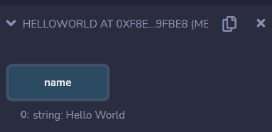

# Remix e os contratos

Na última seção, vimos que ao definir uma variável de estado como pública, o Remix gera um botão que nos permite ler essa variável do contrato. Obtemos o valor `Hello World` como retorno ao clicar no botão azul chamado `name`.

Para cada método possível de interação com um contrato inteligente, o Remix gera um botão para executar tal método. Em termos mais técnicos, o Remix implementa a interface com o contrato inteligente. Apesar de nos ajudar, essa funcionalidade pode gerar certa confusão para quem está começando a aprender sobre aplicações descentralizadas.

Deve ficar claro que a implementação da interface com contratos inteligentes é responsabilidade do desenvolvedor. Ferramentas como o Remix e os exploradores de blocos (que veremos adiante) criam essa interface, mas seu uso fica restrito ao ambiente em que são criados.

Em termos gerais, existem duas formas de interagir com um contrato inteligente: por meio de **transações** (transactions) ou **calls**. Apenas recuperar algum estado do blockchain sem alterá-lo não requer uma transação. Lembre-se de que as transações de alguma forma mudam o estado global da rede. Para recuperar (ler) o estado, você precisa fazer uma *call*.

Uma *call* é como um pedido de informação à rede, que deve ser enviado para algum nó (cliente). O protocolo de solicitação é JSON-RPC; veremos mais adiante. Por enquanto, vamos entender o que o Remix faz.

Ao criar o botão para executar um método no contrato, o Remix escreve a *call* para você. Isso é muito útil para testarmos os contratos enquanto estamos escrevendo-os. Caso o deploy tenha sido feita na máquina virtual local, não há necessidade de indicar mais nada para fazer a *call*; basta clicar no botão e o Remix cuida do resto. Quando fazemos a implementação do contrato em um blockchain real, devemos indicar um nó para enviar a *call* (ou a transação).

A cor do botão gerada pelo Remix também é importante, pois indica se o método a ser executado será uma *call* ou uma transação. Botões azuis indicam *calls*, enquanto botões laranja indicam transações, como veremos em breve. Botões vermelhos indicam transações que envolvem o envio de ether.

Na próxima lição, criaremos nossa primeira função em um contrato.